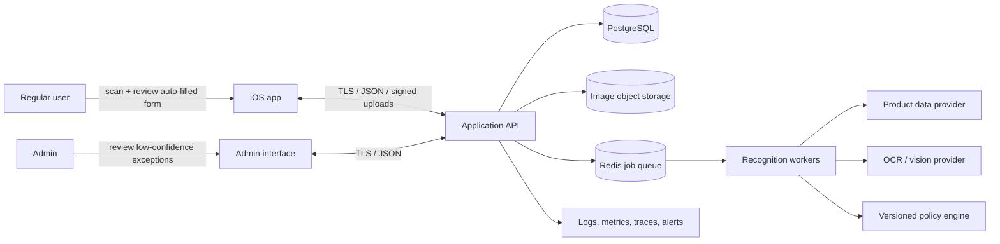
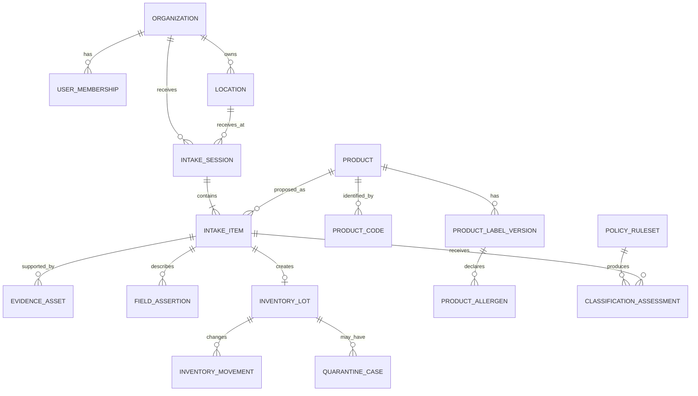

# Food Donation Intake - System Design

Status: proposed architecture for MVP and pilot
Primary client: iPhone
Architecture style: offline-capable native client + modular-monolith API + asynchronous recognition workers
Last updated: 2026-09-17

## 1. Executive decision

Build the first release around a **verified inventory lot**, with straight-through acceptance for reliable records and admin review for exceptions.

The iPhone app scans a UPC/EAN or GS1/QR code, photographs the package and date label, and automatically fills the intake form. A regular user reviews the result and manually enters or corrects data only when needed. The server stores each value with its source and confidence. Records that meet all configured confidence, completeness, shelf-life, and safety rules are accepted automatically; low-confidence or exceptional records go to an admin. A barcode lookup is the preferred identity path; image recognition is the fallback, never the sole authority for allergens or expiration.

Use a modular monolith initially:

- **iOS:** SwiftUI, VisionKit/Vision, AVFoundation fallback, SwiftData/Core Data outbox, URLSession.
- **Backend:** TypeScript with NestJS, OpenAPI contracts, PostgreSQL, Redis-backed jobs, S3-compatible object storage.
- **Identity:** managed OIDC provider with two application roles: regular user and admin.
- **Recognition:** provider adapters behind internal interfaces, beginning with on-device barcode/text recognition and a server-side product lookup adapter.
- **Deployment:** one API service and one worker service on a managed container platform. Do not introduce microservices or Kubernetes for the pilot.

The recommended MVP handles one packaged item or homogeneous case at a time. Multi-item scene counting, produce recognition, and automatic nutrition-label parsing are later capabilities.

## 2. Scope and assumptions

### MVP goals

1. Start an anonymous donation intake and identify its receiving location; no donor identity or contact information is collected.
2. Scan UPC-A, UPC-E, EAN-8, EAN-13, Code 128, QR, and GS1 data where present.
3. Resolve or create a product.
4. Capture quantity, unit of measure, date type/value, lot code, storage requirement, package condition, and images.
5. Capture label-supported allergens, calories, serving information, and nutrition facts when available.
6. Calculate a versioned NTFB-aligned nutrition classification.
7. Route uncertainty or food-safety concerns to review/quarantine.
8. Automatically accept eligible records and route exceptions to an admin for accept, correct, quarantine, or reject decisions.
9. Atomically create inventory and its receiving movement after automatic or admin acceptance.
10. Work without connectivity and synchronize later without double counting.

### Explicitly outside the MVP

- Diagnosing whether food is safe from a photograph.
- Guaranteeing allergen absence.
- Estimating nutrition for unlabeled food from appearance alone.
- Identifying and counting mixed piles of products in live video.
- Full warehouse-management, order-picking, route-planning, or donor-CRM functionality.
- Replacing a food bank's food-safety policy or trained staff judgment.

## 3. Policy interpretation

The referenced North Texas Food Bank (NTFB) Food & Nutrition Policy is a **nutrition and sourcing policy**, not a complete food-safety standard. Its rules should be stored in a versioned policy engine rather than hard-coded into the mobile app.

The 2021 revision says, among other things:

- The overall distribution goal is greater than 90% nutritious food.
- SWAP/HER ranks food using saturated fat, sodium, and sugar into green (choose often), yellow (choose sometimes), and red (choose rarely).
- Green and yellow are treated as nutritious; red is treated as non-nutritious for the policy's reporting model.
- The donated-food target is at least 80% nutritious and at most 20% non-nutritious; purchased-food budget is intended for nutritious foods.
- The policy does **not** ban a particular food merely because it is in the red tier.
- Program boxes should normally include at least four of the five MyPlate groups; nutrition aids/supplements should normally stay at or below 10% of a build except in disasters/emergencies.
- The inventory taxonomy includes descriptors such as LSU, LSA, VG, OR, GF, LF, WG, HVY SYP, LT SYP, 100%, PCKD OIL, and PCKD WTR.
- Policy categories and descriptors are subject to annual review.

Therefore the application must keep these outcomes separate:

| Outcome | Example values | Meaning |
|---|---|---|
| `nutrition_tier` | green, yellow, red, unclassified | Nutrition/program reporting and sourcing guidance |
| `disposition_status` | accepted, review_required, quarantined, rejected | Operational food-safety decision |
| `inventory_status` | available, reserved, distributed, disposed | Physical stock lifecycle |

A red item can still be accepted. A green item with damaged packaging or an unresolved cold-chain problem can be quarantined. Policy rules need effective dates, rule-set versions, exceptions, and admin approval; the admin may obtain subject-matter review before activation.

## 4. Context and trust boundaries



Trust boundaries:

- The device is untrusted until the access token, organization, role, and location scope are validated.
- Barcode/product-provider data is untrusted external input; normalize and retain its source.
- OCR and image classification produce candidates, not facts.
- Object storage is private. Clients use short-lived signed upload/download URLs.
- Only the API commits inventory, applies policy, and authorizes overrides.

## 5. Core intake flow

```mermaid
sequenceDiagram
    actor R as Regular user
    actor S as Admin
    participant I as iOS app
    participant A as API
    participant W as Worker
    participant D as Database

    R->>I: Start anonymous intake; select location
    I->>I: Create local session and idempotency key
    R->>I: Scan code or photograph item
    I->>I: Decode barcode/QR and run fast OCR
    I->>A: Lookup normalized code
    A->>W: Query cached/provider product data
    W-->>A: Product candidate + provenance
    A-->>I: Candidate fields and missing evidence
    R->>I: Review auto-filled form; edit only if needed
    I->>A: Upload evidence and submit item mutation
    A->>W: OCR, date parsing, nutrition/policy evaluation
    W-->>A: Field candidates, confidence, rule-set result
    A-->>I: Acceptance result or admin-review reason
    R->>I: Submit intake record
    I->>A: Submit with idempotency key and record version
    alt Meets automatic-acceptance rules
        A->>D: Transaction: accepted lot + assertions + audit + RECEIVE movement
        A-->>I: Accepted inventory lot receipt
    else Low confidence, conflict, or safety exception
        A-->>I: Pending admin review
        S->>A: Accept, correct, quarantine, or reject
        A->>D: Persist decision, audit, and any resulting lot/movement
    end
```

### Capture decision tree

1. **Barcode/QR found:** parse locally, normalize GTIN, call product lookup.
2. **GS1 data present:** parse identifiers and attributes separately. GS1 application identifiers may carry GTIN, lot, best-before, or expiry; do not treat arbitrary QR URLs as trusted product data.
3. **No database match:** capture front, ingredients/allergen panel, nutrition facts, and printed date.
4. **No code:** image model may suggest a category/name. The regular user must confirm identity and required lot fields.
5. **Loose produce:** choose a controlled catalog item, enter weight/count, and mark date as not printed/unknown if appropriate.
6. **Mixed case:** split into homogeneous intake items; do not store one approximate lot with conflicting products or dates.

## 6. Field confidence and review rules

Every value is a field assertion:

```json
{
  "field": "date.value",
  "value": "2026-10-14",
  "sourceType": "ocr",
  "sourceRef": "evidence_01J...",
  "confidence": 0.91,
  "modelVersion": "apple-vision/device-build",
  "status": "confirmed",
  "confirmedBy": "user_01J...",
  "confirmedAt": "2026-09-17T18:42:00Z"
}
```

Suggested review policy:

| Field | May be proposed automatically | Auto-accept? | Human requirement |
|---|---:|---:|---|
| Product name/brand from known GTIN | Yes | Yes, at high confidence | Regular user corrects if package differs |
| Quantity | Yes | Yes after regular-user review | Enter or correct when counting is unavailable/wrong |
| Date text/value/type | Yes | Yes after regular-user confirmation and rule validation | Confirm value and whether it is use-by, best-before, sell-by, packed-on, or unknown |
| Lot code | Yes | No | Confirm when required by local policy |
| Allergens | Yes, only from database or label OCR | Yes only from a trusted matching label version or regular-user-confirmed visible label | Never infer absence; conflicts require admin review |
| Calories and serving information | Yes, from trusted product data or Nutrition Facts OCR | Yes when the label version matches and required context is complete | Correct calories, basis (`per_serving` or `per_100g`), serving size, and servings per container when needed |
| Nutrition values | Yes | Only from trusted provider/version | Review missing or conflicting values |
| SWAP/HER tier | Yes, via rules | Yes when all inputs are verified | Otherwise `unclassified` or review |
| Package condition / temperature | No | Yes when regular user reports an acceptable condition and no rule is triggered | Admin reviews reported damage or cold-chain concern |
| Final disposition | Rule engine decides or recommends | Yes only when every automatic-acceptance condition passes | Admin decides all exceptions and overrides |

Date parsing must retain the raw printed text, locale assumption, date type, precision, and image crop. Ambiguous values such as `03/04/26`, illegible text, or dates without a type must never silently become expiration dates.

For this design, **date type** means the words that explain what a printed date represents. Store one of `use_by`, `expiration`, `best_if_used_by`, `best_before`, `sell_by`, `freeze_by`, `packed_on`, `manufactured_on`, `unknown`, or `none`, plus the original printed phrase. These labels are not interchangeable: for example, a sell-by date is intended for store inventory management, while a best-if-used-by date normally concerns quality. The default acceptance threshold is 14 remaining days for shelf-stable and frozen food and 7 remaining days for refrigerated/perishable food. An admin may configure stricter category-specific rules. Loose produce or other food without a printed date uses `none` and requires a condition check; the app must not invent an expiration date. Infant formula must never be accepted after its printed use-by date.

Calories are optional and must carry context. Store `calorie_status` (`recorded`, `not_labeled`, `not_applicable`, or `unknown`) instead of using zero for missing data. For packaged food, retain the printed calories, basis, serving size, servings per container, source, and verification state. A derived package or lot total may be displayed only when its inputs are sufficient—for example, `calories_per_serving × servings_per_container × package_count`—and must be labeled as calculated rather than printed. Do not estimate calories from a general item photograph in the MVP.

Capture the FDA's nine major allergen groups: milk, egg, fish, Crustacean shellfish, tree nuts, peanuts, wheat, soybeans, and sesame. Preserve the specific fish, shellfish, or tree-nut type when the label provides it. Declaration types are `contains`, `cross_contact_advisory` (for label text such as “may contain” or shared equipment/facility language), `not_declared_on_label`, and `unknown`. `Not_declared_on_label` must never be presented as “allergen-free.” A regular user may confirm a faithful transcription from a visible package label; only an admin may resolve conflicting evidence, override a declaration, or change the allergen ruleset.

### Roles and acceptance routing

| Capability | Regular user | Admin |
|---|:---:|:---:|
| Scan codes and capture images | Yes | Yes |
| Review automatically filled fields | Yes | Yes |
| Enter or correct missing intake data | Yes | Yes |
| Submit an intake record | Yes | Yes |
| View own/location intake status | Yes | Yes |
| Review exception queue | No | Yes |
| Accept, quarantine, or reject an exception | No | Yes |
| Override evidence, classification, or disposition | No | Yes |
| Configure confidence thresholds and rulesets | No | Yes |
| Manage users and locations | No | Yes |

Automatic acceptance is a server-side rule, not a mobile privilege. It occurs only when every required field is complete; identity and required extracted fields meet admin-configured confidence thresholds; the regular user has reviewed the form; shelf-life and policy checks pass; no evidence conflicts exist; no duplicate is suspected; and package/cold-chain observations raise no concern. The system evaluates confidence per field rather than using one opaque overall score. Any failed condition sets the record to `pending_admin_review` with explicit reason codes.

Recommended pilot routing defaults:

- Treat an exact, checksum-valid barcode match to a current catalog record as high-confidence product identity.
- Require at least `0.90` confidence for each required OCR-derived field after regular-user review; the admin can change this threshold.
- Route image-only product identification to admin review regardless of the model score during the pilot.
- Route missing required fields, conflicting providers/evidence, ambiguous date type, suspected duplicate, shelf-life exception, damaged packaging, or cold-chain concern to the admin.
- A regular user's manual correction is preserved as new evidence; it does not erase the machine result or automatically bypass an exception rule.

## 7. Logical data model



### Main tables

| Table | Important columns |
|---|---|
| `organizations` | `id`, `name`, `timezone`, `status` |
| `user_memberships` | `user_id`, `organization_id`, `role` (`regular_user` or `admin`), `location_scope` |
| `locations` | `id`, `organization_id`, `name`, `type`, `timezone`, `storage_capabilities` |
| `intake_sessions` | `id`, `receiving_location_id`, `received_at`, optional non-identifying `source_channel`, `status`, `created_by`, `client_mutation_id` |
| `products` | `id`, canonical name, brand, category, food group, default unit, status |
| `product_codes` | `product_id`, `scheme`, `normalized_code`, `raw_code`, `provider`, `unique(scheme, normalized_code)` |
| `product_label_versions` | `product_id`, ingredient text, calories, calorie basis, serving size/unit, servings per container, nutrition JSON, market, effective dates, source/evidence |
| `product_allergens` | `label_version_id`, allergen code, declaration type (`contains`, `cross_contact_advisory`, `not_declared_on_label`, `unknown`), exact label text, evidence |
| `intake_items` | `session_id`, `product_id`, quantity/units, package condition, temperature, date type/value/precision, lot code, storage type, status (`draft`, `submitted`, `auto_accepted`, `pending_admin_review`, `admin_accepted`, `quarantined`, `rejected`), routing reasons, version |
| `evidence_assets` | object key, content hash, type, crop coordinates, capture time, retention class, malware-scan state |
| `field_assertions` | entity/field, typed value, source, confidence, model/provider version, review state, reviewer |
| `policy_rulesets` | name, version, effective dates, status, parameters JSON, approver |
| `classification_assessments` | item/lot, ruleset version, inputs snapshot, tier, descriptors, explanation, override |
| `inventory_lots` | product, location, on-hand quantity, unit, date data, lot code, disposition, nutrition tier, row version |
| `inventory_movements` | lot, type, quantity delta, source/destination, actor, reason, timestamp, idempotency key |
| `quarantine_cases` | lot/item, reason code, notes, opened/resolved by, resolution |
| `audit_events` | actor, action, target, before/after JSON, request id, timestamp |
| `sync_mutations` | organization, device, client mutation id, result, applied time |

Do not store expiration, received quantity, or physical location on `products`; those facts belong to the intake item or lot. A practical lot key is product + receiving location + date type/value + lot code + storage type, but automatic merging should be disabled until staff validates the rule.

## 8. API boundary

Use `/v1`, JSON, UTC ISO-8601 timestamps, cursor pagination, RFC 9457 problem details, ETags/row versions, and an `Idempotency-Key` header for every create/finalize/movement operation.

| Method and path | Purpose |
|---|---|
| `POST /v1/intake-sessions` | Start a donation intake |
| `POST /v1/product-lookups` | Resolve barcode/QR/GTIN without committing inventory |
| `POST /v1/evidence/upload-requests` | Obtain short-lived signed upload URL |
| `POST /v1/intake-sessions/{id}/items` | Create a draft item from local capture |
| `POST /v1/intake-items/{id}/recognition-jobs` | Request OCR/vision enrichment |
| `GET /v1/recognition-jobs/{id}` | Poll job or recover after reconnect |
| `PATCH /v1/intake-items/{id}` | Correct candidate fields using `If-Match` |
| `POST /v1/intake-items/{id}/submit` | Submit an auto-filled/reviewed record for automatic acceptance or admin routing |
| `GET /v1/admin/review-queue` | List low-confidence and exceptional records; admin only |
| `POST /v1/admin/intake-items/{id}/decision` | Accept, correct, quarantine, or reject an exception; admin only |
| `POST /v1/intake-sessions/{id}/finalize` | Close a session after all items are accepted, routed, or rejected |
| `GET /v1/inventory-lots` | Search/filter current inventory |
| `GET /v1/donation-items` | Dashboard of every intake item with optional lot, decision, date urgency, and inventory state |
| `POST /v1/inventory-movements` | Relocate, adjust, distribute, or dispose |
| `GET /v1/policy-rulesets/current` | Give client display labels/help text; server remains authoritative |

The default inventory dashboard query sorts actionable dates ascending with undated items last. It marks past dates red, dates from today through the next 14 days yellow/amber, dates more than 14 days away green, and missing/unusable dates gray. Each mark includes a text label and the exact printed date type; color indicates inventory urgency, not food safety or nutrition quality. See [Donation dashboard requirements](docs/phase-0/donation-dashboard.md).

Example product-lookup response:

```json
{
  "normalizedCode": "00012345678905",
  "scheme": "gtin14",
  "match": {
    "productId": "prod_01J...",
    "name": "Low-sodium black beans",
    "brand": "Example",
    "confidence": 0.98,
    "source": "internal_catalog",
    "sourceUpdatedAt": "2026-09-01T12:00:00Z"
  },
  "nutrition": {
    "calories": 110,
    "basis": "per_serving",
    "servingSize": 130,
    "servingSizeUnit": "g",
    "servingsPerContainer": 3.5,
    "source": "product_label",
    "verificationStatus": "needs_confirmation"
  },
  "requiredCaptures": ["date", "package_condition"],
  "warnings": []
}
```

## 9. Offline and synchronization design

The mobile client uses a durable local outbox:

- Generate UUIDv7/ULID IDs and `clientMutationId` values on-device.
- Store draft session, item, evidence metadata, and pending mutations under iOS data protection.
- Upload blobs first; submit metadata only after upload completion.
- Retry with exponential backoff and the same idempotency key.
- Server records the first result for a mutation key and returns it on retry.
- Use optimistic concurrency (`version`/ETag). Never use last-write-wins for quantity, disposition, allergens, or dates.
- If a server record changed while offline, preserve both versions and require conflict resolution.
- Show `Draft`, `Waiting to sync`, `Needs review`, and `Received` as distinct states.

Duplicate protection needs more than barcode equality. Detect likely duplicates using intake session, code/product, quantity, capture time, image hash, date/lot, and device mutation ID; warn the regular user rather than silently discarding uncertain matches.

## 10. Recognition design

### On device

- VisionKit `DataScannerViewController` for live text and code scanning where supported.
- Vision barcode detection and AVFoundation as compatibility/fallback paths.
- High-resolution still capture for date, ingredient/allergen, and Nutrition Facts regions, including calories and serving information.
- Lightweight preprocessing: crop guidance, orientation, blur/glare checks, and duplicate-frame suppression.
- Optional on-device OCR for immediate feedback; server reruns critical extraction when configured.

### On server

- Normalize UPC/EAN/GTIN and parse GS1 application identifiers deterministically.
- Check the internal catalog cache, then Open Food Facts as the initial external product-data provider; store provider, retrieval time, and license-required attribution. Keep the adapter boundary so another provider can be added later.
- OCR images and parse candidate dates with label keywords and locale. Never reduce raw OCR to one date without evidence.
- Parse calories only together with their printed basis and serving information. Store label calories as printed; calculate package or donated-lot calories as derived values with the formula and input versions retained.
- Use image classification only for candidate category/product ranking when code lookup fails.
- Run the versioned nutrition rules using verified nutrient/category inputs.
- Record model, prompt/configuration, provider, latency, and confidence for reproducibility.

Provider adapters prevent an external database or model from becoming the system of record. Responses should be cached, normalized, and reviewed against package evidence because community-maintained product data can be missing, stale, or wrong.

## 11. Security, privacy, and safety

- OIDC with short-lived access tokens; refresh credentials stored in iOS Keychain.
- Roles are deliberately limited to `regular_user` and `admin`. Authorization is enforced by the API, not only hidden in the interface.
- Every query is organization-scoped and authorized against the user's role and location scope.
- TLS in transit; managed encryption at rest for database, backups, and objects.
- Private object buckets, short-lived signed URLs, content-type/size validation, malware scanning, and removal of unnecessary image metadata.
- Do not collect donor identity, contact information, addresses, receipts, or other donor PII. An optional non-identifying source channel may support operational reporting.
- Configurable retention: retain audit facts longer than raw package images; legal/policy owners approve actual periods.
- Immutable audit entries for submissions, automatic-acceptance decisions, admin decisions, corrections, overrides, quarantine resolution, and disposal.
- Never display “allergen-free” from absence of a match. Use `unknown` unless supported by a current label or authorized source.
- Keep nutrition tier visually and semantically distinct from safety status.
- Backups with tested point-in-time recovery; quarterly restore exercise for production.

Before deployment, the food bank must provide or approve separate rules for package damage, recalls, temperature control, date handling, salvage, and disposal. Those rules are not fully defined by the referenced nutrition policy.

## 12. Reliability and operations

Initial service objectives for the pilot:

- Local scan feedback: p95 under 500 ms after a stable code is visible.
- Cached lookup API: p95 under 750 ms; external-provider misses may complete asynchronously.
- Finalize request: p95 under 2 seconds, excluding image upload.
- No accepted duplicate inventory movements under client retries.
- 99.9% monthly API availability, while the mobile outbox keeps intake usable during outages.
- Recovery point objective <= 15 minutes and recovery time objective <= 4 hours for the pilot; revisit with business owners.

Measure:

- median/p95 intake time per item;
- code match rate and no-match rate;
- per-field OCR acceptance and correction rate;
- calorie-label capture coverage and correction rate;
- percentage of allergen/date fields requiring review;
- automatic-acceptance rate and admin-review reason distribution;
- duplicate warnings and prevented duplicate movements;
- sync queue age and failed mutations;
- quarantine causes and resolution time;
- inventory adjustment rate;
- green/yellow/red/unclassified pounds received and distributed, tied to policy version;
- progress toward the policy's donated and distributed nutrition targets.

Use structured logs with request/job IDs, distributed traces across API/workers/providers, and dashboards that exclude image contents and sensitive operational data.

## 13. Deployment shape and scaling

For the pilot, deploy:

1. One stateless API service (minimum two instances in production).
2. One independently scalable worker service.
3. Managed PostgreSQL with point-in-time recovery.
4. Managed Redis/queue.
5. Private object storage with lifecycle rules.
6. CDN only for approved public/static assets, never raw evidence by default.

Scale workers separately because OCR/vision is CPU/GPU- and provider-latency-heavy. Partition high-volume job queues by task type and priority. Keep transactional inventory writes in PostgreSQL. Add a read replica or warehouse export only when reporting harms transactional workload. Split a recognition service from the monolith only when load, deployment cadence, or team ownership demonstrates the need.

Capacity planning should use measured pilot data. A useful planning envelope is 100 concurrent regular users, 100,000 item captures/day, and 3-5 images/item; object storage and recognition cost, not relational rows, will dominate.

## 14. Test strategy

- **Unit:** GTIN normalization/check digits, GS1 parsing, date parsing, policy rules, quantity conversions, role checks.
- **Golden-image:** glare, curved cans, dot-matrix dates, low contrast, rotated labels, multilingual labels, damaged barcodes.
- **Contract:** iOS client generated from OpenAPI; provider adapters tested with recorded fixtures.
- **Property/fuzz:** QR payloads, malformed barcodes, OCR strings, image metadata, and unit conversions.
- **Integration:** upload -> recognition -> review -> finalize -> inventory movement.
- **Offline:** process death, device reboot, repeated taps, reordered retries, expired signed URLs, and server conflicts.
- **Safety:** allergen conflicts, ambiguous dates, recalled/quarantined product, invalid override roles.
- **Load:** intake shift bursts and large image queues.
- **User acceptance:** regular users working with gloves, poor lighting, mixed connectivity, English/Spanish UI, VoiceOver, and Dynamic Type.

Create a labeled pilot set from real donation environments and report accuracy per field—not one blended “AI accuracy” number. False-negative allergen and date errors deserve separate, stricter review.

## 15. Delivery plan

### Phase 0 - domain and policy validation

- Validate required intake fields, units, the default 7/14-day shelf-life thresholds, quarantine reasons, storage zones, and retention.
- Convert the approved NTFB interpretation and local food-safety rules into versioned acceptance tests.
- Establish a labeled sample set and baseline time per item.

Working artifacts: [Phase 0 domain and policy validation](docs/phase-0/README.md).

Exit: signed field dictionary, workflow states, policy rules, and safety escalation matrix.

### Phase 1 - vertical slice

- Authentication, organization/location scope, intake session.
- Barcode scan, cached/provider lookup, date photo, quantity entry.
- Auto-filled review form, evidence upload, automatic acceptance, admin exception review, lot creation, receiving movement, and audit log.
- Basic inventory list and CSV export.

Exit: one real packaged item can become a trustworthy inventory lot end to end.

### Phase 2 - pilot reliability

- Durable offline outbox, idempotency, conflict UI, duplicate detection.
- Admin exception review/quarantine, expiry views, alerts, retention jobs, and observability.
- Accessibility/localization and operational runbooks.

Exit: 10-20 users complete several hundred items with measured correction and reconciliation rates.

### Phase 3 - nutrition and richer recognition

- Label OCR for ingredients, calories, serving information, other nutrition values, and allergens.
- Versioned SWAP/HER assessments and NTFB descriptor support.
- Loose produce catalog, multi-item assistance, partner reports.

Exit: policy dashboards reconcile to inventory movements, and field-level accuracy meets thresholds approved by policy/safety owners.

### Phase 4 - distribution operations

- FEFO suggestions (earliest appropriate date first), outbound scans, reservations, transfers, recalls, source-channel reports, and optional future warehouse/ERP integration.

## 16. Confirmed implementation defaults

| Decision | Approved default |
|---|---|
| Date meanings | Record the label's meaning: use-by, expiration, best-if-used-by, best-before, sell-by, freeze-by, packed-on, manufactured-on, unknown, or none. Preserve the exact printed phrase and image. |
| Minimum remaining shelf life | 14 days for shelf-stable/frozen; 7 days for refrigerated/perishable. Rules are admin-configurable by category. Date-less fresh items require condition review. |
| Allergens | Capture the FDA major nine and preserve specific fish, shellfish, or tree nut. Store `contains`, `cross_contact_advisory`, `not_declared_on_label`, or `unknown`. Regular user confirms visible label text; admin resolves conflicts/overrides. |
| Donor data | Donation intake is anonymous. Do not collect donor identity, contact, address, or receipt information. |
| Existing-system integration | None. PostgreSQL is the initial system of record for product, intake, lot, and movement data. |
| Health/recipient data | No HIPAA-like adjacent workflow is required. Do not collect recipient health data. |
| Product data | Use Open Food Facts first, under its Open Database License terms, behind a provider adapter and internal cache. Fall back to package capture and manual confirmation when data is missing. |
| Roles and approval | Regular users scan and review automatically filled intake forms, using manual entry only when needed. Eligible records are accepted automatically; admins decide low-confidence, conflicting, or safety-sensitive exceptions. |
| Rule ownership | Admin owns, approves, versions, activates, and retires nutrition, food-safety, and confidence-routing rulesets. |
| Device support | Minimum deployment target: iOS 20.0. |

Before production, the admin must validate the proposed 7/14-day threshold table against the organization's operating and food-safety procedures. The system supports versioning these thresholds without an app release.

## 17. Reference notes

- [NTFB Food & Nutrition Policy - original URL](https://ntfb.org/wp-content/uploads/2024/07/NTFB-Food-Nutrition-Policy-revised-8.17.2021-1.pdf) (the original returned HTTP 410 when checked on 2026-09-17; design review used an archived copy plus indexed text).
- [Archived NTFB policy PDF](https://web.archive.org/web/20250320053319id_/https://ntfb.org/wp-content/uploads/2024/07/NTFB-Food-Nutrition-Policy-revised-8.17.2021-1.pdf).
- [Apple VisionKit DataScannerViewController](https://developer.apple.com/documentation/visionkit/datascannerviewcontroller) supports live text and machine-readable-code scanning and high-resolution photo capture.
- [Apple Vision text recognition](https://developer.apple.com/documentation/vision/recognizetextrequest) provides recognized text observations and configurable languages/accuracy.
- [Open Food Facts product-by-barcode API](https://openfoodfacts.github.io/documentation/docs/Product-Opener/v3/products/get-api-v3-product-code/) can supply product candidates, subject to verification and its data/license terms.
- [GS1 2D retail implementation guideline](https://ref.gs1.org/guidelines/2d-in-retail/1.0.0/GS1-2DRetailPOS-Guideline-i1.0-r-2024-05-28) defines identifiers including GTIN, lot, production date, best-before, expiry, and serial number.
- [USDA Food Product Dating guidance](https://www.fsis.usda.gov/food-safety/safe-food-handling-and-preparation/food-safety-basics/food-product-dating) explains the distinct meanings of best-if-used-by, sell-by, use-by, and freeze-by labels.
- [FDA Food Allergies guidance](https://www.fda.gov/food/nutrition-food-labeling-and-critical-foods/food-allergies) defines the nine major allergen groups; advisory statements such as “may contain” are distinct from required contains declarations.
- [Open Food Facts licensing](https://openfoodfacts.github.io/openfoodfacts-server/api/tutorials/license-be-on-the-legal-side/) describes its Open Database License obligations.
