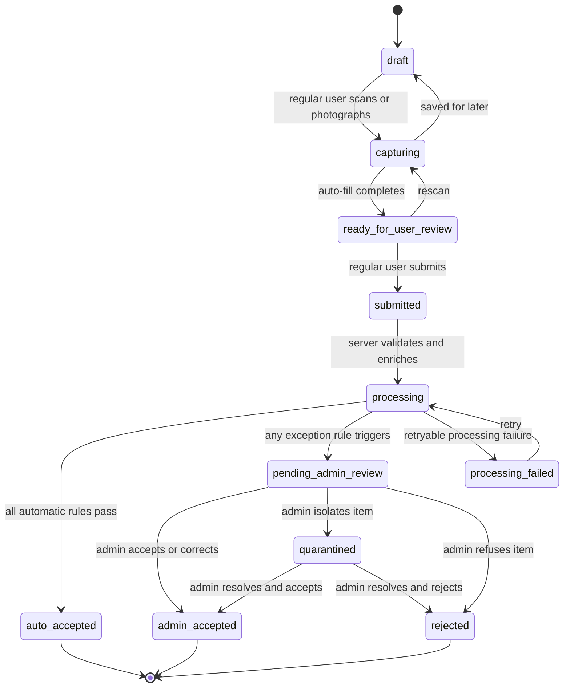

# Workflow States

Status: proposed for admin sign-off

## Intake-item state machine

## State definitions

| State | Meaning | Who may act | Next action |
|---|---|---|---|
| `draft` | Local or server draft; no inventory exists. | Regular user, admin | Resume or delete own draft. |
| `capturing` | Scanning, photography, lookup, or OCR is active. | Regular user, admin, system | Finish auto-fill or save draft. |
| `ready_for_user_review` | Auto-filled form is ready for review/correction. | Regular user, admin | Submit or rescan. |
| `submitted` | Immutable submission snapshot received. | System | Start server validation. |
| `processing` | Recognition, conflict, duplicate, and policy rules are running. | System | Auto-accept or route. |
| `processing_failed` | A retryable technical failure prevented a decision. | System/admin | Retry; never create inventory twice. |
| `auto_accepted` | All straight-through rules passed. | System | Transaction creates available lot and RECEIVE movement. |
| `pending_admin_review` | One or more explicit exceptions require admin action. | Admin | Correct/accept, quarantine, or reject. |
| `admin_accepted` | Admin accepted the submitted or corrected snapshot. | Admin | Transaction creates available lot and RECEIVE movement. |
| `quarantined` | Item is recorded but unavailable pending physical/process resolution. | Admin | Accept or reject with reason. |
| `rejected` | Item will not enter available inventory. | Admin | Record handling/disposal outcome if applicable. |

## Transaction boundary

- `auto_accepted` and `admin_accepted` atomically create the inventory lot, assertions, audit event, and `RECEIVE` movement.
- `quarantined` creates or updates a lot only in a quarantine location/status; it is never counted as available stock.
- `rejected` does not create available inventory. If the physical item had already entered a quarantine location, its final movement is recorded.
- Repeating any request with the same idempotency key returns the original result and does not add quantity twice.

## User-visible language

| Internal state | Regular-user label | Admin label |
|---|---|---|
| `draft` | Draft | Draft |
| `capturing` | Scanning | Capturing |
| `ready_for_user_review` | Ready to review | Ready to review |
| `submitted` / `processing` | Checking information | Processing |
| `auto_accepted` | Added to inventory | Automatically accepted |
| `pending_admin_review` | Waiting for admin review | Needs review |
| `admin_accepted` | Added to inventory | Accepted by admin |
| `quarantined` | Held for review | Quarantined |
| `rejected` | Not accepted | Rejected |
| `processing_failed` | Couldn't finish - will retry | Processing failed |
